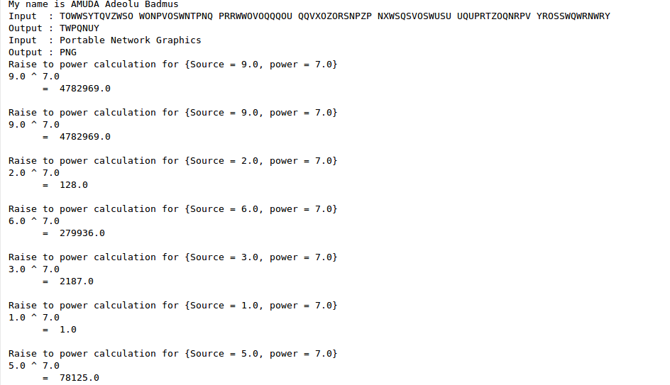
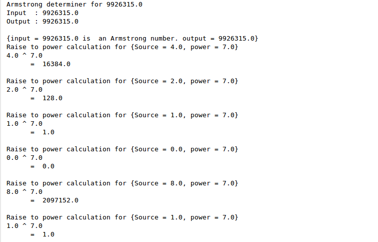
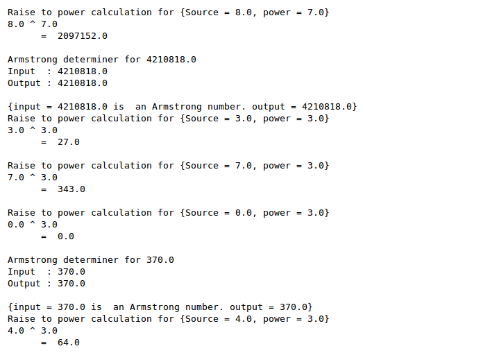
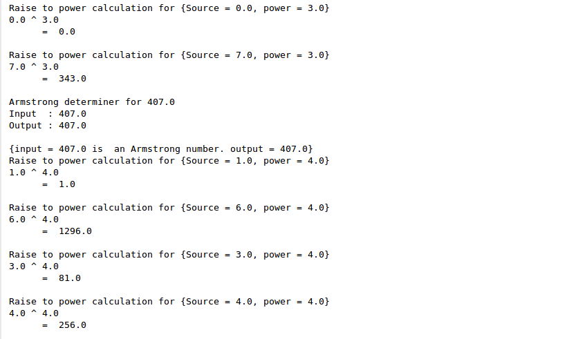
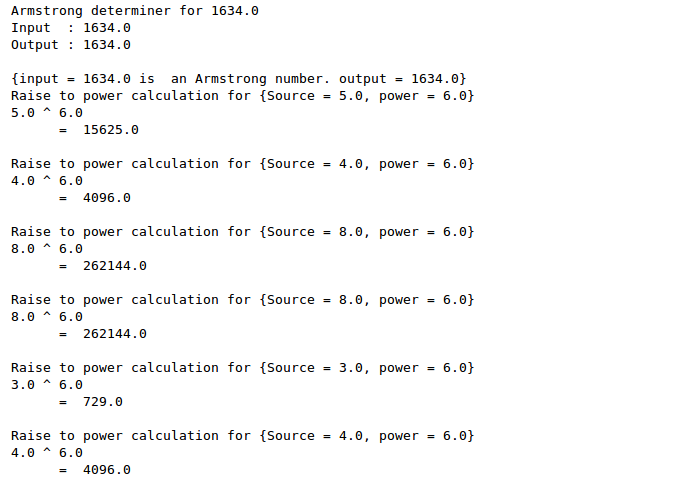
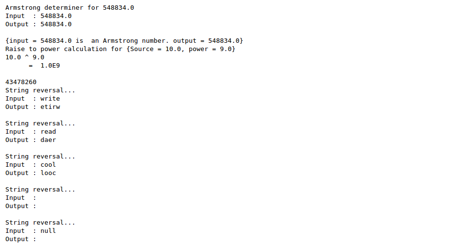
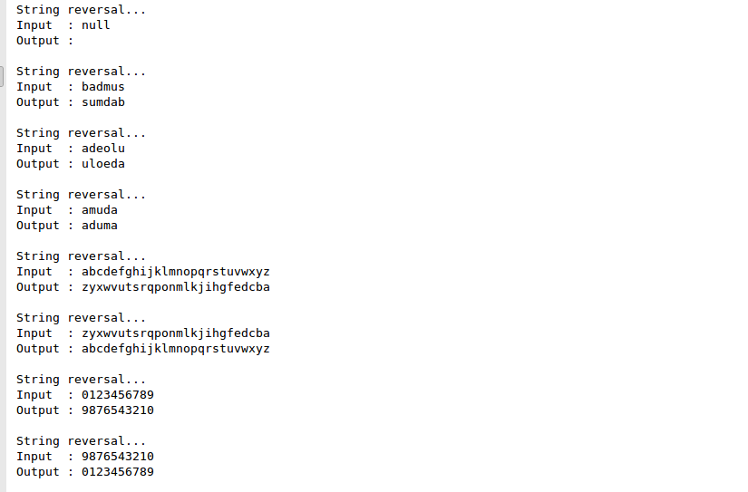
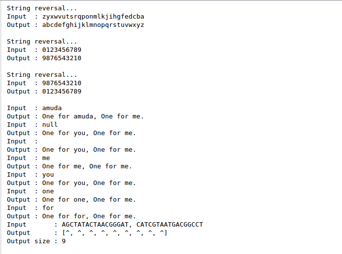

#<a href="https://u-write.herokuapp.com" target="_blank"> U-Write </a>

<b>What is this ?</b>
 
<a> <ul>My solutions to http://exercism.io/languages/java/exercises incorporated into
 <a href="https://u-write.herokuapp.com" target="_blank"> JavaEE app named "u-write"</a>.
</ul>
 

 
 
<h3>Focus/Outcome</h4>
<li>Solve all the problems</li>
<li>Implement some/most of the solution into a JavaEE app with the following functionalities</li>
 

 

 

 

 

 

 

 

 

</a>
